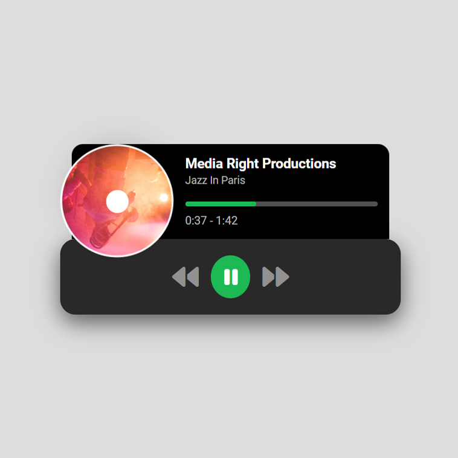

# Minify: A Mini Spotify/Music Player

## Overview

**Minify** is a lightweight music player designed to provide a streamlined and engaging experience for playing your favorite tracks. With a simple interface and essential playback controls, Minify brings the functionality of a music player right to your browser.


## Technologies Used

- **HTML**: For structuring the music player and its components.
- **CSS**: For styling the player and creating a visually appealing, user-friendly interface.
- **JavaScript**: To implement playback controls including play, pause, next, and previous tracks, as well as track progress functionality.

## Features

- **Play/Pause Control**: Easily play and pause music with a single click.
- **Next/Previous Track**: Navigate through your playlist effortlessly.
- **Track Progress Control**: Scrub through the track to find your favorite part.
- **Minimalist Design**: A clean and modern interface designed with user experience in mind.

## Installation

1. Clone this repository:
    ```bash
    git clone https://github.com/vwdr/Minify.git
    ```
2. Open `index.html` in your preferred web browser to start using the music player.

## Usage

1. Load `index.html` in your browser.
2. Use the play/pause button to start or stop the music.
3. Click the next/previous buttons to switch tracks.
4. Drag the progress bar to seek through the track.

## What I Learned

- **HTML Structure**: Setting up the basic structure of the HTML file to accommodate the music player.
- **CSS Styling**: Styling the music player with CSS to make it visually appealing and user-friendly.
- **JavaScript Functionality**: Implementing JavaScript to handle play, pause, next, and previous controls.
- **User Experience Enhancement**: Adding features like track progress control to improve user interaction.

## Development

1. **HTML Structure**: Created the basic HTML layout for the music player, including controls for play, pause, next, and previous, as well as a progress bar.

2. **CSS Styling**: Designed the player with CSS to ensure it is visually appealing and intuitive to use.

3. **JavaScript Functionality**: Implemented core functionality with JavaScript for playback controls and progress tracking.

4. **Enhanced User Experience**: Added features to improve usability, such as visual feedback for track progress and smooth transitions between tracks.

### Challenges

- **Cross-Browser Compatibility**: Ensured that the player functions correctly across different web browsers.
- **Responsive Design**: Adapted the layout and controls to work well on different screen sizes and devices.
- **Playback Control Accuracy**: Fine-tuned JavaScript to ensure precise handling of playback controls and progress tracking.

## Future Improvements

- **Playlist Management**: Add functionality for users to manage and save playlists.
- **Custom Skins**: Allow users to choose from different visual themes for the player.
- **Advanced Features**: Implement features like volume control, shuffle mode, and repeat options.

## Contributing

Contributions are welcome! Please fork the repository and submit a pull request with your changes. For bug reports or feature requests, open an issue on GitHub.

## License

This project is licensed under the MIT License - see the [LICENSE](LICENSE) file for details.

